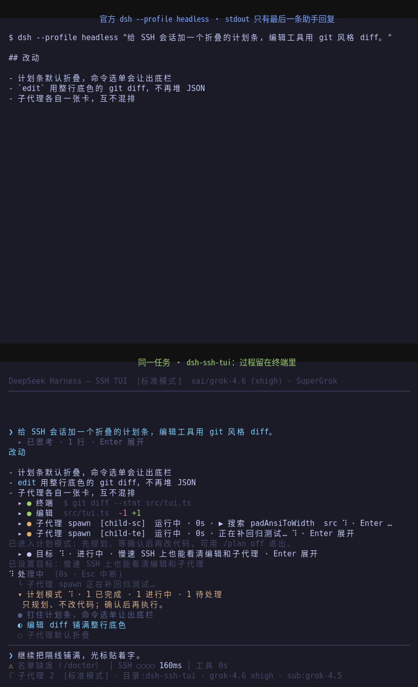
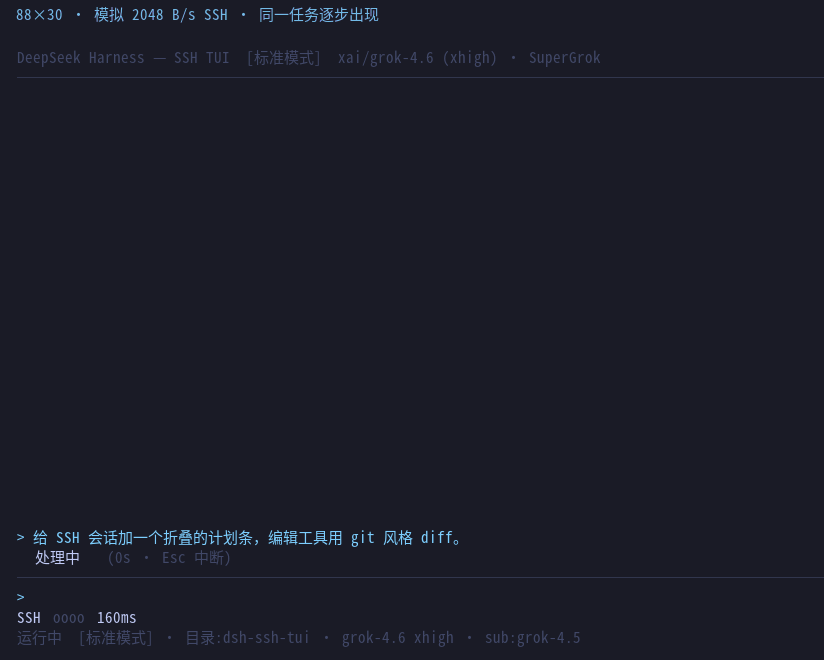

# dsh-ssh-tui

A DeepSeek Harness terminal for jump hosts, headless servers, and high-latency
SSH. Plain ANSI and incremental redraws. No browser required.

中文部署指南：[README.md](README.md)

If you mostly work over SSH — a jump host, a test box, a keyboard-only
session — start here. A local desktop terminal with themes and layout
you already like can stay as it is.

Listed on the [dshfind plugin directory](https://dshfind.com/en/plugins/cyjyyd/dsh-ssh-tui):

[](https://dshfind.com/en/plugins/cyjyyd/dsh-ssh-tui?ref=badge)

Install with the official CLI (no clone):

```sh
dsh plugin --profile tui add dsh-ssh-tui
dsh --profile tui
```

Current `dsh` requires `--profile` (`dsh plugin add …` errors without it).
Swap `tui` for another profile name. The same command updates. Remove with
`dsh plugin --profile tui remove dsh-ssh-tui`.

## Official headless vs this TUI

There is no shipped TUI. The default terminal entry on a remote box is
`dsh --profile headless`: one task, then the **last assistant message** on
stdout. Reasoning, tool calls, subagents, and the plan stay in the session
log.

Both frames below are the **same task**. Top: official headless stdout
(`@deepseek-ai/dsh-headless` prints `outcome.text` only). Bottom: this plugin
painting the same events in an 88-column SSH window.



Top: `$ dsh --profile headless "…"` then the final markdown.  
Bottom: reasoning collapsed, full-row red/green diff, each subagent on its
own card, the plan strip pinned above the input.

Singles: [headless stdout](docs/screenshots/headless.png) · [dsh-ssh-tui](docs/screenshots/workspace.png)

## Still visible on a slow SSH pipe

Same task, replayed at **2 kB/s** through the real incremental painter
(88×30, one `stdout.write` per frame). Official headless on that pipe
would stay blank until the final markdown. Here reasoning, the edit
diff, subagent cards, and the plan strip appear as the bytes arrive.



Reproducible, no model in the loop: `npm run screenshots:slow` writes
`docs/screenshots/slow-link.json`. This capture is 14 paints, about
**15.5 KB**, **7.6 s** at 2 kB/s. Byte ledger for this event sequence.

## Requirements

- Node.js >= 22.19
- `@deepseek-ai/dsh` CLI: `npm i -g @deepseek-ai/dsh`
- pnpm (used by `dsh plugin` to manage profile dependencies)

## Install

The recommended install is the command at the top of this README:
`dsh plugin --profile tui add dsh-ssh-tui`. The CLI pulls npm, writes the
profile dependency, and appends this package to `dsh.profile.bundles`
because the manifest declares `dsh.bundle`.

Optional: reuse a SuperGrok / grok-bridge token already on the machine:

```sh
dsh plugin --profile tui add dsh-llm-xai-oauth
dsh plugin --profile headless add dsh-llm-xai-oauth
```

Smoke the route before opening the TUI. The TUI exits immediately without a TTY:

```sh
dsh --profile headless "Reply with exactly: tui-install-ok. Do not use tools."
dsh --profile tui
```

From a checkout: `bash scripts/smoke-headless.sh` (prints an outcome summary, never a token).

### Survive an SSH drop (tmux)

A slow-link-friendly painter is not the same as surviving a disconnect.
Closing the laptop or an idle jump host kills the TTY process. Put the TUI
in tmux so SSH is only the display:

```sh
tmux new -s dsh -- dsh --profile tui
# after reconnecting
tmux attach -t dsh
```

A second TUI on the same `sessionId` is refused (it would steal stdin and
approvals) and prints `tmux attach`. Locks live under `$DSH_HOME/tui-locks/`;
a leftover file from a crash is stolen if the pid is dead.
`DSH_TUI_NO_SESSION_LOCK=1` skips this.

On start the TUI checks npm for a newer `dsh-ssh-tui` and **notifies only**:

```text
发现新版本 dsh-ssh-tui 0.3.5（当前 0.3.4）。更新：dsh plugin --profile tui add dsh-ssh-tui
```

Set `DSH_TUI_NO_UPDATE_CHECK=1` to skip. `/status` also shows the plugin version.

From git:

```sh
git clone https://github.com/cyjyyd/dsh-ssh-tui.git
cd dsh-ssh-tui
bash scripts/install.sh          # installs into the `tui` profile
```

Or manually:

```sh
npm install --no-audit --no-fund
npm run build
dsh plugin --profile tui add "link:$(pwd)"
```

For the optional **智能路由模式 (routing-suite)** mode, also run:

```sh
bash scripts/install-routing-suite.sh
```

The script adds `dsh-routing-suite`, registers its preset for the `/mode`
menu, and mounts the in-box loopback `webServer` service (`127.0.0.1` on an
OS-assigned port) that the plugin requires for its read-only status API.

Set `DEEPSEEK_API_KEY` (or a `$DSH_HOME/settings.yaml` / `.env` with the
credentials), then start:

```sh
dsh --profile tui
```

Verify and uninstall:

```sh
bash scripts/verify.sh
bash scripts/uninstall.sh
```

## First-launch setup

On first launch (when no API key is configured) the TUI opens a setup wizard:

1. choose a provider template, matching the official Models page:
   - DeepSeek official;
   - OpenCode Go (`opencode.ai/zen/go/v1`, Responses protocol);
   - custom OpenAI-compatible gateway (Completions);
   - custom OpenAI Responses gateway;
   - Anthropic Messages-compatible gateway;
2. for custom providers, enter a lowercase Provider ID (permanent), base URL,
   API key (masked while typing), and one or more model IDs — each step has a
   sensible template default. On the models step, press `Ctrl+F` to fetch the
   current model list straight from the provider endpoint;
3. confirm and save.

The wizard writes the key to `~/.dsh/.credentials.yaml` when no environment
variable shadows it; if the machine injects `DEEPSEEK_API_KEY` from
`/etc/profile.d` or similar, it writes `~/.dsh/env.sh` (sourced by
`~/.profile` / `~/.bashrc` / `~/.zshenv` / `~/.zshrc` automatically,
idempotently) so your
value wins on the next launch. On Windows it runs `setx` and writes
`%USERPROFILE%\.dsh\env.cmd` as a fallback. Custom gateway base URLs are saved
to `$DSH_HOME/settings.yaml` as an `llm-pi-ai.providers.<id>` route (the same
shape the official custom-provider form writes). After saving a custom
provider, exit and launch with:

The wizard also remembers the selected provider/model in
`agent-default-model` (the same settings memory the official Models page
uses), so after setup you can just run:

```sh
dsh --profile tui
```

`--provider <id> --model <id>` remains available as a temporary override.

You can reopen the wizard at any time with:

```sh
/setup
```

## Cross-platform support

The plugin runs on Linux, macOS, and Windows (Node ≥ 22.19):

- Linux/macOS: same command as above; the wizard persists credentials in
  `~/.dsh/.credentials.yaml`, or `~/.dsh/env.sh` when a system-injected
  environment variable must be overridden.
- Windows (PowerShell or Windows Terminal): install with the same npm/dsh
  commands — `dsh` is on PATH via npm's global bin. The wizard stores the key
  through the dsh credential store, or runs `setx` (plus `env.cmd`) when an
  environment variable shadows the store. Agent shell tools automatically use
  PowerShell on Windows (the harness disables bash there).
- Legacy Windows consoles without VT support: set `DSH_TUI_NO_ALT_SCREEN=1`
  (and `--no-color` if needed) to skip the alternate-screen escape sequences.
- Keyboard input accepts both `\x7f` and `\x08` backspace, and both `\r` /
  `\r\n` line endings.

## Usage

| Key | Action |
| --- | --- |
| `Enter` | send; while running, steer; with empty input, toggle the selected card |
| `Tab` | complete the highlighted slash command |
| `↑` / `↓` | empty input: move among cards; otherwise history. Same as `Ctrl+N` / `Ctrl+P` |
| `Ctrl+R` | expand or collapse all cards |
| `Ctrl+T` | fold the input box (display-only) |
| `Alt+1` / `2` / `3` / `4` | jump to latest thinking / plan / subagent / reply |
| `/find [kind] query` | search and jump to the full matching message (`thinking` `plan` `subagent` `reply`). `Ctrl+/` or `Alt+/` opens it |
| `Ctrl+G` / `Alt+N` | next search hit; `Alt+P` previous |
| `Esc` | drop selection → scroll to bottom → cancel the running turn |
| `Ctrl+C` | cancel the running turn; exit when idle |
| `Ctrl+D` | exit |
| `Ctrl+L` | redraw |
| `y` / `n` / `Esc` | answer an approval prompt |
| `1..9` + `Enter` | answer an `ask_user_question` dialog |

Type `/` to see slash-command suggestions — the panel merges the TUI's own
commands (`/find`, `/model`, `/provider`, `/help`, ...) with every command the harness
registers (`/goal`, `/plan`, `/compact`, `/permission`, `/feedback`, ...).
`/compact` shows a spinning 「压缩上下文」 card and footer until it
finishes, then the tokens recovered. `Tab` completes, `Enter` runs.
`/help` lists everything.

`/model` lists models for the **current** provider only. On SuperGrok that
is `grok-4.6` / `grok-4.5` plus reasoning effort (`xhigh` on 4.6). `/provider`
switches provider, then model; it takes effect on the **next request** — no
restart. Each provider’s last model and effort is remembered. `/setup` adds
or updates one API-key provider without wiping the others. SuperGrok / X
Premium uses local OAuth and does not need a key.

For OpenCode and other third-party providers, `/model` queries the provider's
endpoint (`GET {baseURL}/models`) for a live model list, falling back to the
configured catalog when the endpoint cannot be reached. Picking a model that
is not stored in the provider profile automatically adds it to
`llm-pi-ai.providers.<id>.models` so the harness can serve it.

Subagents follow the parent session's provider by default and run on the
lightweight `deepseek-v4-flash` model. `/submodel [model-id]` picks (or
directly sets) the subagent model, and `/subeffort` picks the subagent
reasoning effort or restores the provider default. Both commands are
remembered under `ssh-tui-subagent` in `$DSH_HOME/settings.yaml`.
`/subagents` lists active subagents, and `/subagents kill <session-id> [more ids...]`
releases selected continuable children using the harness 0.1.1
`drainContinuableChildren` capability.

Each subagent is its own collapsible card. One or many children start collapsed,
so the parent transcript stays readable; `Enter`, click, empty-input `↑`/`↓`,
and `Ctrl+R` expand or collapse them independently. Running cards show a spinner,
and the status/title line shows `⠋ 子代理 N` instead of mixing child output
into the parent stream.

The plan strip pins only the **latest incomplete plan**. When the model
opens a new plan in the same turn, the previous one archives into the
scrolling transcript and the dock shows the new one. A finished plan says
「计划任务已全部完成」, not 「计划模式已关闭」. If a turn ends with open todos, the strip says 「本轮未收尾」, stops
spinning, and sends one follow-up asking the model to `todo_write` the
real statuses. The `/` menu and
approval/question dialogs yield that bottom space. `exit_plan_mode` is
markdown. `ask_user_question` still opens a dialog and leaves a collapsed
`提问用户` card. `/goal` is a collapsed `目标` card. `/find thinking foo`
or `Alt+1..4` jumps to the matching category.

Interrupted streaming output keeps the already-generated prefix and is marked
`⚠ interrupted`; team collaboration session events (`team/*`) are surfaced as
system messages. Harness slash commands that accept image attachments are
labelled `(images ok)` in the command list and completion hints.

`/usage` (alias `/balance`; `/quota` still works) follows the **current** provider:

- **DeepSeek official** `GET {baseURL}/user/balance`;
- **OpenAI Completions gateways** probe `/user/balance` and `credit_grants`;
- **SuperGrok** reads `GET cli-chat-proxy.grok.com/v1/billing` (weekly remaining %);
- **OpenCode Go** reads the official `/v1/usage` windows (5-hour / week / month);
- **OpenCode Zen** is metered — the TUI points at `https://opencode.ai/zen`.

OpenCode Go / SuperGrok quota is fetched silently at start and on a
window-based cadence; the footer shows remaining %. A ⚠ transcript line
appears only when remaining crosses 50% / 25% / 10% / 5%. `/usage` or
`/balance` still prints the full snapshot. Cadence: every 10 turns for a
5-hour cap (every 4 when near), every 50 for weekly (every 10 when near),
every 80 for monthly (every 20 when near).

The startup screen shows the official DeepSeek whale logo (rendered from the
harness favicon) in the DeepSeek brand color, with the wordmark below it. The
logo scales to the terminal width — a 52-column variant on wide terminals,
down to a compact variant on narrow ones — so it never looks squeezed. A
horizontal rule separates the workspace (transcript, reasoning, tool cards)
from the input area.

Model reasoning blocks are collapsed by default: while thinking a compact
`▸ 思考中 ⠹ · N 字 · Ns` line with a spinner replaces the raw stream, and
after the turn each block collapses to a `▸ 已思考 · N 行` summary without
its content. The thinking block can be expanded live while streaming to watch
the raw reasoning as it arrives. Assistant replies render in bold white with
terminal markdown support: heading levels (H1 enlarged/underlined, H2
underlined, H3 colored), bold, italic, inline code, fenced code blocks,
lists, quotes, and links all get ANSI styling while remaining
width-wrapped for the terminal. Reasoning, tool, subagent, plan, and question cards are
each expandable/collapsible independently. Empty input: `↑`/`↓` (same as
`Ctrl+N`/`Ctrl+P`) move the highlight, `Enter` toggles, `Ctrl+R` toggles all,
`Esc` drops the selection. Click a card header to toggle it. Subagent cards
start collapsed even when several run at once. `Alt+1..4` jumps to the latest
thinking / plan / subagent / reply.

The transcript is scrollable: `PgUp`/`PgDn` or the mouse wheel move back
through earlier reasoning blocks and tool calls, a `↑ 已回看 N 行` indicator
shows the scroll position, and `Esc` (or sending a message) returns to the
live bottom.

The terminal window title mirrors the session state while unfocused: an
animated spinner plus `运行中 · 工具 N` while working, `✓ 已完成` for a few
seconds after completion, and `待命` when idle. A terminal bell rings on
completion (`DSH_TUI_NO_BELL=1` disables it).

Tool calls render as compact cards instead of raw argument JSON. A colored
dot leads each card — yellow while running, green on success, red on failure
(a shell command with a non-zero exit or signal also turns red, with a
`[退出码 N]` / `[信号 X]` suffix). Shell tools show the command as
`$ command`, file mutations (`edit` / `write` / `str_replace_editor`) render
the applied change git-style: a path header, `-` lines on a light-red
background, `+` lines on a light-green background, and a `└ +N -M · K file(s)`
footer. File-mutation diffs are shown in full (never collapsed to a `… more`
line) and their cards start expanded. Other tools show a short argument
summary and start collapsed to a single line (the command, truncated with
`…` when long); expand to reveal output or the result body. Expanded generic
calls convert their JSON arguments and JSON results into readable indented
content — key/value fields, bullet lists, and multiline blocks for
code/content — instead of raw JSON text.

A web-aligned session stats line sits below the input box: turn/step counts,
model and tool wall time, first-token latency, tokens/second, cache-hit
percentage, and billed input/output tokens (`输入 12.3K · 输出 1.2K`), updated
as the session progresses.

While a turn is waiting on the provider, the status line shows
`等待响应 Ns`; if nothing arrives for 60s a warning appears and `Esc` /
`Ctrl+C` cancels the turn. Follow-ups sent while a turn is running are
acknowledged immediately (`⚡ … 排队 N`) and take effect at the next step
boundary, so the UI never looks frozen. Long-running work is not
misclassified: while tools are executing the status shows `工具执行中 N`,
and while subagents are running it shows `⠋ 子代理 N` (no
`等待响应`/stall warning). Plan mode adds `计划模式`, and a pending question
adds `等待用户回答` / `计划待审`. Child output stays inside that child's
collapsed card instead of being prefixed onto parent transcript lines;
`/subagents` lists active runs.

`/mode` opens the agent-mode picker backed by dsh's official preset roster:
标准模式 (standard), PTC 模式 (ptc; `code` on dsh 0.1.1), 极简模式 (minimal), 创造模式 (cordis),
智能路由模式 (routing-suite, from `dsh-routing-suite`),
plus any locally authored presets (e.g. `whoami-standard`). On a session that
has not produced work the switch applies immediately; otherwise it is remembered
as the default for the next launch. The active mode is shown in the
header/status line.

`/resume` switches the running TUI to a past session. With no argument it
opens a picker of recent sessions (excluding subagents), labeled by the user's
first message with a time/cwd description; `/resume <session-id>` switches
directly. Switching is refused while a turn is running.

```sh
dsh --profile tui --model deepseek-v4-flash
dsh --profile tui --no-color
dsh --profile tui --resume <session-id>
```

`dsh --profile tui` starts a fresh session directly in the main interface.
`dsh --profile tui --resume` (or `dsh --profile tui resume`) opens the
history-session picker before the main interface; `dsh --profile tui --resume
<session-id>` (or `dsh --profile tui resume <session-id>`) skips the picker
and resumes directly. `dsh --profile tui --new` explicitly starts fresh
without the picker. The in-app `/resume` command remains available for
switching while running.

## Jump-host / proxied SSH

Each paint is one `stdout.write` of dirty rows only, so a jump host or
corporate proxy does not see one SSH packet per line. Local ttys use 80 ms.
Over SSH the TUI probes CSI 6n once and picks 80 / 160 / 250 / 400 ms from
the round-trip. `DSH_TUI_PAINT_MS` always wins (40–1000). The stats line
starts with `SSH ●●●○ 90ms` (1 pip red, 2 yellow, 3+ green). The probe
does not write into the transcript.

SSH disconnect still kills a TUI that is not inside tmux. Do not start a
second copy of the same session from another window.

## Development

```sh
npm install
npm run build
```

## Privacy

All sessions, credentials, and settings live under `$DSH_HOME` (default
`~/.dsh`) — never inside this repository. `.gitignore` excludes
`node_modules/`, build output, `.env*`, keys, session logs, and local state, so
cloning or uploading the repo never carries user sessions or secrets.

## License

MIT
