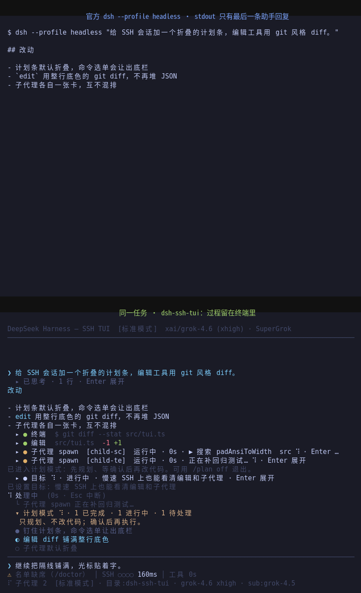
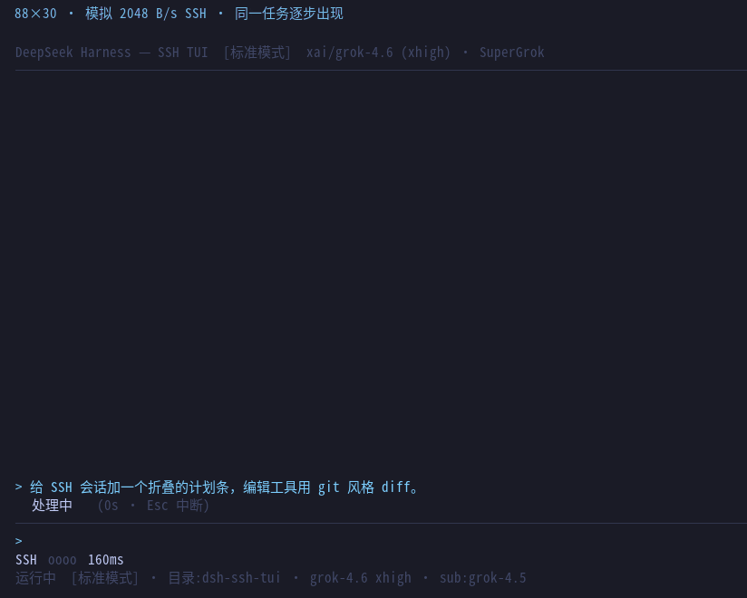

# dsh-ssh-tui

[](https://www.npmjs.com/package/dsh-ssh-tui)
[](https://www.npmjs.com/package/dsh-ssh-tui)
[](https://github.com/cyjyyd/dsh-ssh-tui/actions/workflows/ci.yml)
[](https://dshfind.com/zh/plugins/cyjyyd/dsh-ssh-tui?ref=badge)

**A resilient terminal frontend for DeepSeek Harness.**

纯 ANSI · 增量重绘 · SSH 断线重接 · Windows / ConPTY · Host-aware activation · 无需浏览器

**连接可以断，终端可以换，Harness 可以升级；正在工作的会话不应该因此变得脆弱。**

English: [README.en.md](README.en.md)

---

## 30 秒开始

需要 Node.js ≥ 22.19 和 DeepSeek Harness CLI。

```bash
npm i -g @deepseek-ai/dsh
dsh plugin --profile tui add dsh-ssh-tui@latest
dsh --profile tui
```

恢复旧会话：

```bash
dsh --profile tui --resume
```

更新：

```bash
dsh plugin --profile tui add dsh-ssh-tui@latest
```

> `dsh plugin` 由 profile 内的 pnpm 管理依赖。更新时请显式带 `@latest`，否则已有 lockfile 可能继续沿用旧版本。

Windows 用户见 [Windows 指南](docs/windows.md)。

---

## 为什么会有这个 TUI

DeepSeek Harness 已经有 Web、headless 和不断扩展的插件生态。

`dsh-ssh-tui` 不试图把浏览器搬进终端。

它解决另一类问题：

### 连接不可靠

SSH 会断、笔记本会合盖、网络会切换、跳板机会超时。

正在运行的回合不应该因为显示终端消失，就和整个 Harness Host 一起死亡。

`dsh-ssh-tui` 将 **Host 与显示端分离**：

```text
Harness session
      │
      ▼
   TUI Host
      │
      ├── 当前 SSH / terminal
      │
      └── 断线后重新 attach
```

忙碌中的 Host 可以在显示端离开后继续存在；重新连接后，同一条命令即可接回。

---

### 终端环境并不统一

Linux PTY、Windows ConPTY、SSH、旧控制台、不同 OSC / mouse / clipboard 能力，并不是同一种终端。

本项目不会假定：

```text
process.stdin/stdout == terminal == display == host
```

而是显式区分：

```text
Harness Host
    ↓
Display Transport
    ↓
Terminal Capability
```

TTY 是一种能力，不是宿主存在的前提。

这也是为什么在没有真实终端的 Host 中，插件应该**安全地不激活**，而不是让宿主一起崩掉。

---

### Harness 本身仍在快速变化

本项目把 **兼容性当成功能维护，而不是发版后顺便测试**。

当前声明窗口：

| DeepSeek Harness | 状态 |
|---|---|
| `0.1.7-rc.1` / `0.1.7-rc.2` | ✅ 支持 |
| `0.2.0-rc.1` / `0.2.0-rc.2` | ✅ 支持 |
| `0.1.5` 及更早 | ❌ 自 `dsh-ssh-tui 0.8.0` 起不再支持 |

声明范围：

```text
>=0.1.7-rc.1 <0.1.8
|| >=0.2.0-rc.1 <0.2.1
```

发布前会针对支持线重新安装依赖并运行类型检查、测试和真实终端探针。

不是：

> “安装没有报错，所以应该能用。”

而是尽量回答：

> **“这个 Harness 版本、这个 Host、这个终端路径，我们实际验证过什么？”**

---

## 同一个 Harness，终端里看到完整过程

官方 headless 很适合一次性任务：

```bash
dsh --profile headless "..."
```

它完成任务后将最终回复写到 stdout。

如果你需要持续观察思考、工具、diff、子代理、计划和审批，则可以进入 TUI。

下面是同一个任务：



在 TUI 中：

- reasoning 可折叠、可实时展开；
- 工具调用以卡片呈现；
- edit 显示 git 风格 diff；
- 子代理独立显示；
- plan / approval / ask-user 直接进入交互界面；
- 模型输出持续流式显示，而不是等整个任务结束。

---

## 为弱网而设计

TUI 使用纯 ANSI 和增量重绘，不依赖浏览器或重量级远程 UI。

下面是在 **2 kB/s** 限速下回放真实绘制事件：



该样例可以直接复现：

```bash
npm run screenshots:slow
```

对应数据保存在：

```text
docs/screenshots/slow-link.json
```

目标不是做一个网络 benchmark。

目标是确保：

> **链路越差，界面可以降级；任务本身不能跟着失去可用性。**

---

## 核心能力

### Terminal-native workspace

- 纯 ANSI 渲染；
- Markdown、标题、列表、引用、代码块；
- 工具卡片与 git 风格 diff；
- reasoning 折叠与实时查看；
- plan / approval / ask-user-question；
- 子代理独立状态卡；
- 状态行按一眼扫读的顺序回答五个问题：链路健康、正在做什么、tok/s、额度余量、上下文占用（宽度不够时按优先级逐项收敛，窄屏更简洁而不是更拥挤）；轮数 / 步数 / 模型时间 / 工具时间 / 缓存命中移出常驻行，仍可在 `/status` 与 `/diag` 查看；
- `/model`、`/mode`、`/submodel` 等 Harness 能力直接进入终端。

### Session continuity

- `--resume` 历史会话选择；
- SSH / terminal 断开后重新 attach；
- 一个 session 只允许一个写 Host；
- 新窗口接管时旧显示端有明确退出语义；
- Host 异常退出后可以从 Harness 日志恢复。

### Terminal capability handling

- truecolor / 256 / 8 / no-color；
- Windows Terminal / ConPTY；
- OSC 52 clipboard 能力判断；
- mouse / hyperlink / terminal title 能力控制；
- UTF-8 不可用时 ASCII fallback；
- `DSH_TUI_LINE_MODE=1` 纯行模式，可用于 `tee`、日志和屏幕阅读器。

### Safety and diagnostics

- `/doctor`：检查 profile、依赖和 Harness 组合；
- `/diag`：检查当前 Host、显示通道和 terminal capability；
- `/approval auto`：自动处理明确安全或明确危险的操作；
- 无法确定的动作仍回到用户审批；
- Host / terminal 不满足运行条件时尽量 fail-safe，而不是破坏宿主。

---

## SSH 断了之后

如果只是空闲状态断开，Host 会退出，之后从持久化会话恢复即可。

如果模型正在：

- reasoning；
- 回复；
- 调工具；
- 运行子代理；

TUI 可以保留 Host，并允许重新接入。

```bash
dsh --profile tui --resume
```

或者指定会话：

```bash
dsh --profile tui --resume <session-id>
```

默认策略下，断线会避免无人值守地继续执行需要用户交互的工作。

如果明确希望当前回合在 SSH 断开后继续：

```text
/disconnect continue
```

重新连接后再 attach 即可。

完整生命周期、锁、接管、链路探测与 idle-exit 规则：

[Remote Operations](docs/remote-ops.md)

---

## Windows

Windows 不是“顺便能跑”的平台。

本项目对 Windows 单独处理：

- ConPTY 输入与终端能力；
- Host / display 生命周期；
- Windows Terminal 与传统控制台差异；
- UTF-8 / ASCII fallback；
- named pipe display transport；
- terminal close / reconnect；
- Windows CI 与真实终端探针。

安装方式与 Linux 相同：

```powershell
npm i -g @deepseek-ai/dsh
dsh plugin --profile tui add dsh-ssh-tui@latest
dsh --profile tui
```

完整说明：

[在 Windows 上使用](docs/windows.md)

---

## 官方 Harness Desktop

> ⚠ **不要把本插件加进 Desktop（或 `web`）profile。** 这不是"装了没用"，是**会让应用崩**：
> Desktop 的宿主命令行走的是 web app 的语法（它传 `--no-open`），而命令行在 dsh 里没有仲裁——profile 里每个 app
> 都会用**自己的**语法解析同一份 argv，遇到不认识的旗标直接退出进程。0.8.2 起本插件的 startup 行会在识别到
> "这条命令行不属于我"（Desktop 启动器，或 web app 已接管）时**不认领**它；0.8.1 及更早则会以
> `error: unknown option '--no-open'` 让宿主退出 1，应用随即报 `dsh desktop host exited with 1` 并崩。
> 万一已经加进去了：从 `profiles\desktop\cordis.patch.yml` 里删掉 `ssh-tui-startup` / `ssh-tui` /
> `ssh-tui-routes` / `ssh-tui-subagent` 四行（或从备份恢复该文件），应用立刻恢复。

官方 Desktop 是 GUI 应用，本身**不需要这个 TUI**。

Desktop 内部的 Harness Host 和真正的 console runtime 也不是一回事。

当前 Desktop 启动链没有为终端插件提供真实 TTY，因此：

```text
Desktop Host
    │
    ├── Harness services
    │
    └── no real terminal
```

在这种环境中，`dsh-ssh-tui` 会识别缺少 terminal capability，并保持惰性：

- 不创建显示 Host；
- 不获取 TUI session lock；
- 不挂终端相关 timer；
- 不启动 update check；
- 不应该因为插件无法绘制 TUI 而让 Desktop Host 一起失败。

如果你希望使用终端界面，请安装真正的 CLI，并从真实终端启动：

```bash
npm i -g @deepseek-ai/dsh
dsh --profile tui
```

Desktop / no-TTY Host 的诊断与上游问题记录：

- [Desktop compatibility](docs/desktop.md)
- [Upstream desktop report](docs/upstream-desktop-report.md)

> Desktop-safe 不等于“把 TUI 嵌进 Desktop GUI”。  
> 前者是 Host compatibility；后者需要宿主提供合适的 display transport。

---

## Host、Display、Terminal

项目目前遵循一个简单原则：

```text
             ┌──────────────┐
             │ Harness Host │
             └──────┬───────┘
                    │
              session / events
                    │
             ┌──────▼───────┐
             │   TUI Host   │
             └──────┬───────┘
                    │
             display transport
                    │
        ┌───────────┴───────────┐
        ▼                       ▼
   real TTY / SSH           stdio relay
        │
        ▼
 terminal capability
```

这带来几个约束：

1. **Host 的生命周期不应由某一个显示窗口决定。**
2. **没有 TTY 不等于 Harness Host 不合法。**
3. **终端能力必须检测或明确声明，不能凭平台名称猜。**
4. **掉线、resize、terminal close 都是正常生命周期事件，而不是异常世界。**
5. **兼容性需要可测试，而不是依赖“在作者机器上能跑”。**

维护者侧的生命周期与平台设计：

- [Platform notes](docs/platform.md)
- [Terminal capability matrix](docs/terminals.md)

---

## 适合谁

推荐使用 `dsh-ssh-tui`，如果你经常：

- SSH 到服务器上写代码；
- 通过公司跳板机工作；
- 使用远程开发机 / 测试机；
- 网络延迟高或连接偶尔中断；
- 需要 Windows Terminal / ConPTY；
- 希望 Harness 更新后仍有明确兼容边界；
- 更在意 session continuity 和终端可靠性，而不是浏览器级视觉能力。

如果只跑一次任务并获取最终文本：

```bash
dsh --profile headless "..."
```

通常更加简单。

如果需要浏览器富交互，则继续使用 Harness Web / Desktop。

它们解决的是不同问题。

---

## 常用命令

```bash
# 启动
dsh --profile tui

# 恢复 / 接入会话
dsh --profile tui --resume

# 更新
dsh plugin --profile tui add dsh-ssh-tui@latest

# 卸载
dsh plugin --profile tui remove dsh-ssh-tui
```

TUI 内：

```text
/doctor
/diag
/model
/mode
/submodel
/status
/disconnect
/approval
```

---

## 排障

优先运行：

```text
/doctor
```

检查 profile / Harness / plugin 组合。

当前会话、Host、显示端或 terminal capability 有问题：

```text
/diag
```

Windows：

[docs/windows.md](docs/windows.md)

SSH、掉线、Host 生命周期：

[docs/remote-ops.md](docs/remote-ops.md)

Desktop：

[docs/desktop.md](docs/desktop.md)

终端能力：

[docs/terminals.md](docs/terminals.md)

底层平台设计：

[docs/platform.md](docs/platform.md)

提交 issue 时，建议同时附上 `/doctor` 与 `/diag` 输出。

---

## 可选：SuperGrok / X Premium

如果已经有 SuperGrok / X Premium，可以使用独立插件：

[dsh-llm-xai-oauth](https://github.com/cyjyyd/dsh-llm-xai-oauth)

安装到当前 TUI profile：

```bash
dsh plugin --profile tui add dsh-llm-xai-oauth@latest
```

它和本 TUI 独立：headless、Web 或其它 profile 也可以使用。

---

## Development

```bash
git clone https://github.com/cyjyyd/dsh-ssh-tui.git
cd dsh-ssh-tui

npm install
npm run build
npm test
```

两条不跑"有没有坏"、而跑"有没有守住"的命令：

```bash
npm run freeze   # B2 冻结：八条不变量 + 七条退役路径（unclassified / live source rows / …）
npm run bench    # 性能基线：流式 / 等待 / 报告翻页 / 菜单移动 / 向导打字，并断言都不整屏重画
```

真实终端、断线与平台行为由额外 probe 覆盖。

项目的目标不是让模拟测试代替终端，而是让：

```text
unit / contract tests
        +
real terminal probes
        +
cross-platform CI
```

共同定义“支持”。

---

## Documentation

| 文档 | 内容 |
|---|---|
| [windows.md](docs/windows.md) | Windows 安装、终端与排障 |
| [remote-ops.md](docs/remote-ops.md) | SSH、断线、attach、Host 生命周期 |
| [desktop.md](docs/desktop.md) | 官方 Harness Desktop / no-TTY Host |
| [platform.md](docs/platform.md) | 平台生命周期设计与维护者约束 |
| [release.md](docs/release.md) | 发版流程（硬性规则）与发布前人工门槛 |
| [terminals.md](docs/terminals.md) | Terminal capability 与兼容矩阵 |
| [upstream-desktop-report.md](docs/upstream-desktop-report.md) | 可复现的上游 Desktop 问题记录 |

---

## Project philosophy

这个项目最初是为 SSH、跳板机和弱网环境做的。

这些环境迫使它很早就面对一些桌面应用容易忽略的问题：

- 如果窗口消失，谁拥有 session？
- 如果网络断了，正在运行的任务怎么办？
- 如果没有 TTY，插件应该怎么退出？
- 如果 Windows 和 POSIX 的进程生命周期不同，谁负责 Host？
- 如果终端说自己支持某种能力，但实际上不支持，谁承担后果？
- 如果 Harness 明天换一个 Host，UI 是否必须全部重写？

因此现在更准确的定义不是：

> 一个 SSH 专用 TUI。

而是：

> **一个把 SSH 当作最严苛真实环境之一来设计的 DeepSeek Harness terminal frontend。**

SSH-first.

Host-aware.

Reconnectable.

Compatibility-tested.

---

## License

MIT
